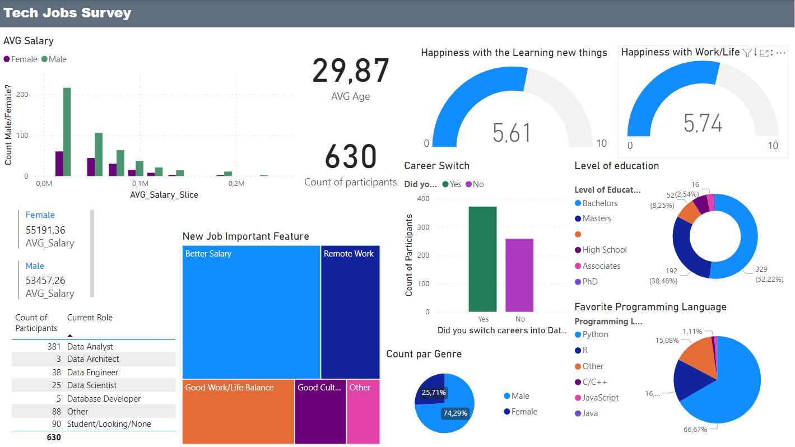

# WHO WORKS IN THE TECH INDUSTRY

## Introduction
A dashboard was created based on a survey made by a Youtuber (Alex the Analyst).
The data was gathered through an online survey where the Youtuber's community went to answer some questions. 
Here are some of them:
* Q1 - Which Title Best Fits your Current Role?	
* Q2 - Did you switch careers into Data?	
* Q3 - Current Yearly Salary (in USD)	
* Q4 - What Industry do you work in?	
* Q5 - Favorite Programming Language	
* Q6 - How Happy are you in your Current Position with the following? (Salary)	
* Q6 - How Happy are you in your Current Position with the following? (Work/Life Balance)		
* Q7 - How difficult was it for you to break into Data?	
* Q8 - If you were to look for a new job today, what would be the most important thing to you?	
* Q9 - Male/Female?	
* Q10 - Current Age
* Q12 - Highest Level of Education

 ## Data transformation
  The participants had the choice to answer some questions in their own words. That creates many customize answers  
  which can be considered when sorting as unique answers, even if they were similar.For that reason, and to facilitate the transformation, 
  we replace those answers with "other". The salary column whereby slice and contained a text, which we modified by extracting the text and 
  calculating the average of each slice.

  Here are the [raw data](https://github.com/Rasoir-genereux/Project_2/blob/main/Project_2/Raw_data.xlsx) and the 
  [transformed data](https://github.com/Rasoir-genereux/Project_2/blob/main/Project_2/Transformed_data.xlsx).

 ## Dashboard
  
  The [dashboard](/Project_2/Dashboard.pbix) shows some interesting findings.  
  Firstly, I would like to remind you that this text is only based on the Dashboard. The results can be different with different datasets. 
  Most workers in the industry (74%) are male and that follows the tendency in many other industries. 
  Nevertheless, the average salary is quite similar between the two genders, which means that employers respect the level of each employee   
  regardless of gender. And yet, men receive higher salaries than women.
  At work, they are quite satisfied with their work/life balance, but they would like a better salary if they had the choice.
  Some of them would like more remote work as it is more and more normal nowadays. The majority of the  participants have a bachelor's degree (52%)
  and a Master's degree. Furthermore, they are, for the most part, Data analysts. That can correlate with the percentage of Bachelor's degree
  since a higher education induces higher jobs.

  
  
  

